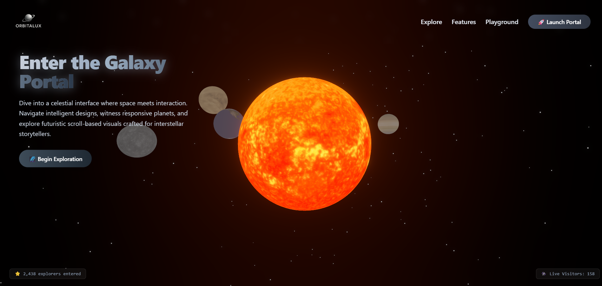

[

# 🌌 Orbitalux

> A Cinematic 3D Galaxy Experience Built with React, Three.js, and GSAP

Orbitalux is not just a landing page — it's an **immersive space voyage**.  
Crafted with futuristic visuals, 3D scroll-based interactions, and intelligent animations, it transforms your browser into a portal to the cosmos.

---

## 🚀 What is Orbitalux?

**Orbitalux** is a stunning, interactive landing experience that combines real-time 3D graphics, deep space aesthetics, ambient sound, and cinematic animations. It leverages **React**, **Three.js**, and **Framer Motion** to create a sci-fi digital universe.

### ✨ Core Features

| Feature | Description |
|--------|-------------|
| 🌞 **3D Portal (Sun)** | Interactive glowing sun with cinematic heatwave effects |
| 🪐 **Planet Explorer** | Slider-based planet viewer with animated transitions |
| 🚀 **Scroll-triggered Galaxy Layers** | Camera moves through galaxy with depth-based scene tone changes |
| 💫 **3D Hover Effects** | Planets and cards react with subtle 3D tilts and glow on hover |
| 🎵 **Ambient Galaxy Sound** | Spacey background music that plays on entry |
| 🌌 **Starfield & Cosmic Gradients** | Realistic animated space background |
| 🧠 **React + GSAP Integration** | Smooth scroll animations and component transitions |
| 📱 **Responsive Design** | Fully optimized across devices (desktop, tablet, mobile) |
| 🔥 **Portal Entry CTA** | "Enter Galaxy" call-to-action with scroll/hover transitions |
| 💡 **Light/Dark Mode Transitions** | Smooth animated theme toggling with consistent UI |

---

## 🧠 Technologies Used

- ⚛️ **React**
- 🌠 **Three.js** & `@react-three/fiber`
- ✨ `@react-three/drei` (starfields, lighting, helpers)
- 🎞️ **Framer Motion**
- 🎯 **GSAP + ScrollTrigger**
- 🎨 **Tailwind CSS v4**
- 🎵 Custom ambient sound & sound toggler
- 🎧 Optional AudioContext integration for immersive music

---

## 📦 Installation & Setup

```bash
# 1. Clone the repo
git clone https://github.com/your-username/orbitalux.git
cd orbitalux

# 2. Install dependencies
npm install

# 3. Run development server
npm run dev

🗂️ Project Structure

orbitalux/
├── public/
│   ├── screenshots/
│   │   └── orbitalux-preview.png
│   └── assets/
│       ├── planets/
│       └── audio/
│           └── ambient-space.mp3
├── src/
│   ├── components/
│   │   ├── GalaxyCanvas.jsx
│   │   ├── Portal.jsx
│   │   ├── Planets.jsx
│   │   ├── PlanetExplorer.jsx
│   │   ├── EnterGalaxy.jsx
│   │   ├── CTAGalaxy.jsx
│   │   └── Footer.jsx
│   ├── styles/
│   │   └── globals.css
│   └── App.jsx
└── README.md

🧪 Key Interactions
Hover over planets → Smooth glow + tooltip or holographic effect

Scroll down → Camera animates between layers using ScrollTrigger

Click "Enter Galaxy" → Triggers ambient music + scene transition

CTA section → Animates every time you scroll to it

Footer → React icons, links, and smooth reveal

🙏 Acknowledgements
React Three Fiber

Drei

Framer Motion

GSAP

Cosmic inspiration from NASA's Visualization Studio

👨‍🚀 Created By
krishna
Space explorer, UI engineer, and digital astronaut.

## 📬 Contact

Have questions, ideas, or want to collaborate?

Feel free to reach out:

- ✉️ Email: krishna.sahu.work@gmail.com

## 📝 License

This project is licensed under the [MIT License](LICENSE).

You are free to use, modify, and distribute this project for both personal and commercial purposes, with proper attribution.

